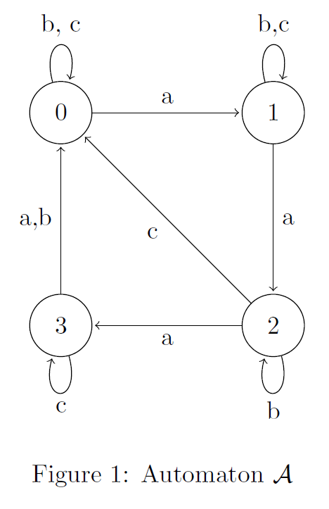

 
Project for my CS477 (Algorithms) class
## P-talk
	- Techniques used
	- Your idea (new)
	- 30 minutes talk per team (slides)

## Timing
	- 30 minutes
	- 25 slides
		- 1 slide per minute
	- 5 minutes for Q&A

## Goals
	- Try to attack something hard.
	- Present in a way so that you can convince your peers.
	- Receive comments from the audience.
  	- Incorporate them into final presentation.

# Source
	[Paper](https://arxiv.org/abs/2103.16185)

