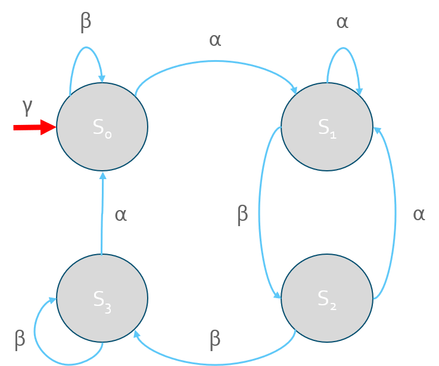
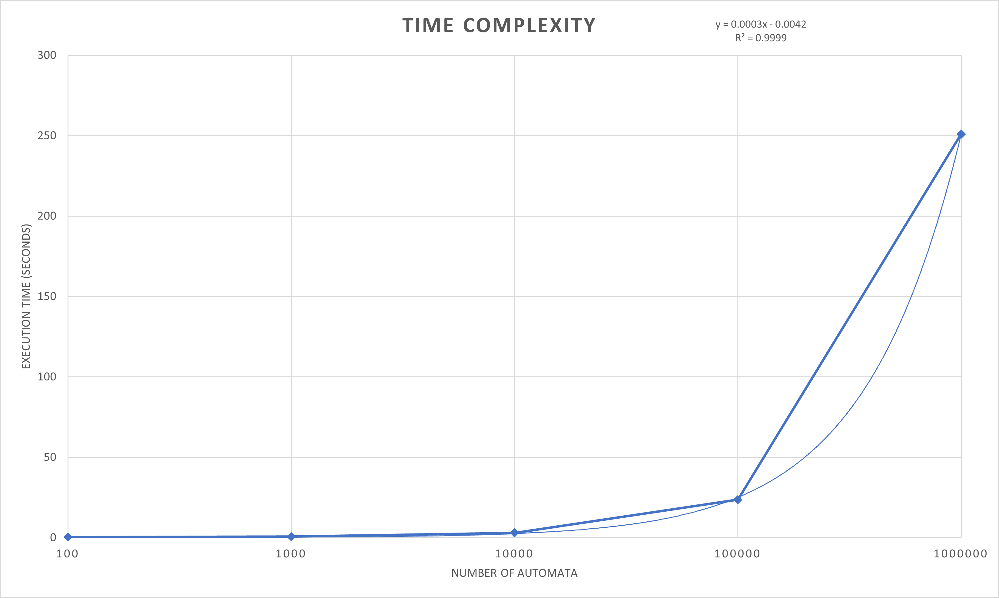
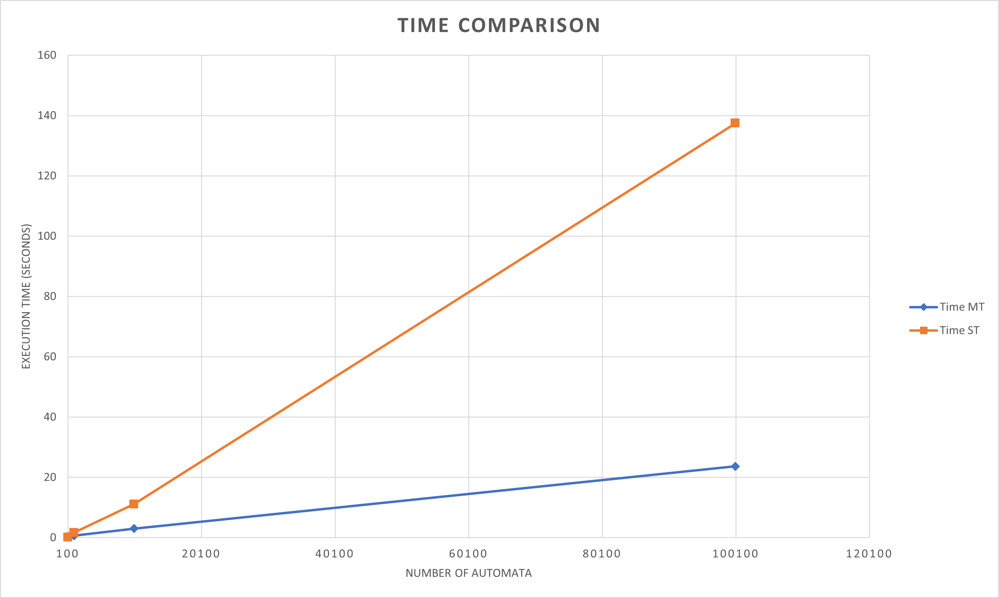

Automata Project for my CS477 (Algorithms) class

# Description
 This project contains a presentation of the [Automata algorithm](https://github.com/Jacobsma/CS477-Project/blob/main/src/Automata.py)
 and a report of the algorithm.

# Running Automata.py
 The Automata.py script takes direct input from the command line and input from a file.
 
### Input
  Input from the command line is in the form
> ./Automata.py -e '\[weightOne,weightTwo,...,weightN\] \[\[weightOneStateOne,weightOneStateTwo,...,weightNStateN\]|\[weightTwoStates\]|...|\[weightNStates\]\]'
> 
> Example: -e '\[1,10\] \[\[1,2,3,4,0,0\]|\[1,2,4,4,5,0\]\]'
>
  Input from a file is in the form 
> ./Automata.py -f 'path/to/file'
>
> Example: -f user/testFiles/automata.txt 
 
### Output 
> -o --output 'path/to/file' 
  
  Directs output to a given file 
### Verbose
> -v --verbose
  
  Enables verbose output
### Timing
> -t --time \['total','init','shortest'\]
 
  Specifies a timing method for the Automata script
### Help
> -h --help
 
  Provides help message

# Generating Automata
  The generateAutomata.py script can be run to generate 1000 random automata into the file *automata.txt*.
  
> **Note**:
> The Automata generated from this script are not guaranteed to be valid. 

# Time Complexity

# Time Comparison

# Source
[Paper](https://arxiv.org/abs/2103.16185)

